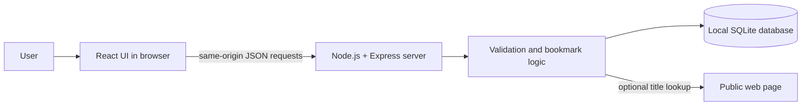

## Proposed Solution

Use a small, single-user web application that runs on the user's machine. Build the browser UI with React and serve its production assets from a local Node.js + Express server. Express exposes a same-origin JSON API for bookmark operations, validates input, coordinates title retrieval, and reads/writes an embedded SQLite database through a Node.js SQLite driver. Bind the server to the loopback interface so it is reachable from the local browser without being exposed as a public service. No cloud service or separately managed database is needed.

The source requirements do not prescribe a language or framework; the selected assignment stack is React, Node.js + Express, and SQLite. Keep the UI, API/business logic, and persistence responsibilities separate enough to test independently. Title lookup is best-effort and must not prevent the user from saving a bookmark when lookup fails.

**Implemented for Feature 1:**

- Accept HTTP and HTTPS bookmark URLs only. Reject empty/invalid URLs, embedded credentials, control characters, and input longer than 2,048 characters.
- If no title is supplied, try a bounded page-title lookup. On failure or a missing title, save without a title, show the hostname as a fallback, and display a non-blocking notice.

**Implemented for Feature 3:**

- Tags are optional on creation. Accept comma-separated labels, trim them, collapse internal whitespace, and deduplicate case-insensitively. Limit each bookmark to 20 unique nonblank tags, with each label at most 40 characters; keep the first stored display spelling. Blank and duplicate entries do not consume the unique-tag limit.

**Implemented for Feature 5:**

- Search title or URL using case-insensitive JavaScript lowercase substring matching, including accented Unicode case pairs; trim surrounding search whitespace and treat `%`, `_`, and `\` as literal characters. Combine a non-empty search with the selected tag filter using AND semantics. Reject repeated or over-200-character search parameters. This in-memory filter is appropriate for the small local single-user collection; reassess if dataset size grows.

**Implemented for Feature 8:**

- Validate URL, title, and tag input in both the browser and server. Show accessible inline field errors and focus the first invalid field; keep server validation authoritative. URL input is limited to HTTP/HTTPS, 2,048 characters, no embedded credentials, no whitespace/control characters, and a valid hostname. Titles are limited to 300 characters; tags use the documented count and length limits.

**Implemented for Feature 9:**

- Compare `normalized_url` values derived from the WHATWG URL parser. Scheme/hostname case, default ports, and URL parser canonicalization (including root path and dot segments) are normalized; path, query, and fragment remain part of the identity. On create, return HTTP 409 with the existing bookmark rather than inserting a duplicate. On edit, apply the same check excluding the current bookmark. Check before optional title retrieval and again inside the write transaction to handle concurrent create requests. The schema keeps a non-unique index so existing duplicate rows do not block startup; all application create/edit paths enforce the policy.

**Optional enhancements implemented after the mandatory features:**

- Favorites are stored as a constrained `favorite` integer flag in SQLite. The schema version is now 2; startup adds the column to older databases and preserves existing rows.
- JSON export serializes URL, title, tags, and favorite state. JSON import accepts either an array or an object containing a `bookmarks` array, submits each valid entry through the normal create API, and reports added, duplicate, and skipped counts.
- Existing tag names populate an HTML `datalist` for tag suggestions. Suggestions are convenience-only; the server remains authoritative for normalization and limits.
- A `POST /api/bookmarks/:id/check-link` endpoint performs a best-effort reachability check through the bounded title-fetcher path. The UI reports reachable, unavailable, checking, and request-error states.
- The UI includes a persisted light/dark theme preference, a keyboard-visible skip link, responsive collection controls, and accessible names/pressed states for enhancement controls.

## Data Model

Use three local relational tables:

| Entity | Fields | Purpose |
| --- | --- | --- |
| `bookmarks` | `id` (stable primary key), `url` (submitted/display URL), `normalized_url` (canonical form used for duplicate comparison), `title` (nullable text), `favorite` (0/1 flag), `created_at` (UTC timestamp), `updated_at` (UTC timestamp) | Stores each saved bookmark, favorite state, and newest-first ordering data. |
| `tags` | `id` (stable primary key), `name` (display text), `normalized_name` (trimmed, whitespace-collapsed, lowercase unique value) | Stores reusable tag labels and deduplicates names case-insensitively. |
| `bookmark_tags` | `bookmark_id`, `tag_id` (composite primary key and foreign keys) | Joins bookmarks to zero or more tags; deleting a bookmark also removes its join rows. |

Generate timestamps when a bookmark is created or updated; list by `created_at` descending, using a stable secondary key for equal timestamps. Store the original URL for display/opening and derive a normalized comparison value for duplicate checks. Keep the comparison index non-unique to avoid a destructive migration if legacy duplicate records exist; create/edit API transactions prevent new duplicates. Tag and URL normalization are defined and implemented as described above.

## UI / User Flow

1. On startup, the browser loads the bookmark list, available tags, and an initial empty state if there are no records. The theme preference is restored from browser local storage.
2. The add form accepts a URL, an optional title, and optional comma-separated tags. On submit, the UI shows progress while the local server validates the URL/tags and, if needed, attempts a safe title lookup.
3. If the URL is invalid, show inline feedback and preserve the entered values. If it is a duplicate, link to the existing bookmark and offer to edit it instead. If title lookup fails, allow the save to complete with a fallback label and a non-blocking notice.
4. After a successful save, refresh the list, showing the newest bookmark first.
5. The list provides title/URL search and a tag selector. Changing either updates the visible results; search and tag selection are combined with AND semantics. A no-match state explains that no bookmarks match the current search/filter and provides a way to clear them.
6. Each bookmark offers favorite, link-check, edit, and delete actions. Editing opens a pre-filled dialog, validates the changed URL/title/tags before saving, and refreshes the current results. If the URL changes and the title is blank, title lookup is attempted; if only the title is cleared, it remains empty. Deleting requires a confirmation or equivalent safeguard; after confirmation, remove it and refresh results.
7. Collection controls can filter favorites, export the current full collection as JSON, import a JSON array/export, and display suggestions from existing tags.
8. On later visits or after restarting the local server, load the saved records from SQLite.

## Error Handling

- Validate required URL input and supported URL syntax on the server as well as in the UI. Return a clear field-level message for empty or clearly invalid URLs; do not save the record.
- Treat title lookup as best-effort: use the supplied title if present; otherwise use a retrieved page title when available. On timeout, inaccessible page, unsupported response, or missing title, save without the fetched title and use the URL/hostname as a display fallback. Show a concise notice without exposing internal stack traces.
- Accept tags as an optional list of strings. Ignore blank entries, collapse whitespace, deduplicate case-insensitively, reject non-text entries, more than 20 unique tags, or labels longer than 40 characters, and report validation errors without partial bookmark/tag writes.
- Update bookmarks with a partial-update API, reject malformed IDs and empty updates, validate any supplied fields using the create rules, preserve omitted fields, and replace tag relationships transactionally when tags are supplied; remove tag records that are no longer associated with any bookmark.
- Delete bookmarks by validated ID in one transaction; rely on foreign-key cascade for bookmark-tag links, clean up now-unused tag rows, return not-found feedback for missing records, and require an explicit user confirmation in the UI before issuing the request.
- Validate search query parameters on the server. Trim surrounding whitespace, cap queries at 200 characters, use literal Unicode-aware substring matching for title/URL, and combine with the selected tag filter. Bind tag IDs as SQL parameters.
- Detect duplicates using canonical `normalized_url` values for both create and edit; return the existing bookmark and avoid a second record.
- For create, edit, or delete persistence errors, retain the current UI state where possible, show that the operation did not complete, and do not display a false success message.
- Distinguish an actually empty bookmark collection from a search/filter with no matches. Provide a friendly message for both.
- Show distinct loading, empty, no-results, API-unavailable, list-load, tag-load, validation, duplicate, title-retrieval, and mutation-error states. Offer retry actions for API health, list loading, and tag loading; keep tag-load failures separate from bookmark-list failures.
- Keep keyboard focus inside modal dialogs, make the background inert while they are open, and restore focus to the invoking control or collection heading after dismissal.
- On database startup or read errors, show a clear local-app error and log diagnostic details locally without logging sensitive request data.
- For import, reject invalid JSON or an invalid top-level shape before sending records; process valid entries through the normal validation and duplicate handling paths, and report counts rather than claiming every entry was imported.
- For link checks, distinguish a reachable response from a failed/unavailable check and do not mutate the saved bookmark based on the result.

## Security Design

- Bind the local server to `127.0.0.1` (or the platform's loopback equivalent), not all network interfaces. Serve the UI and API from one origin and do not enable permissive cross-origin access.
- The API accepts loopback hosts and matching loopback origins only; the non-production Vite proxy origin is explicitly allowed for local development. Do not enable permissive cross-origin access.
- Because title retrieval fetches user-provided URLs from the server, allow only HTTP/HTTPS, reject credentials and local/private/reserved IP destinations, resolve and pin a validated public IP, and revalidate every redirect. Limit redirects to three, title-fetch ports to 80/443, DNS time to three seconds, request time to five seconds, and HTML response size to 512 KiB to mitigate SSRF and resource exhaustion.
- Parse only the page title from a bounded HTML response, strip control characters, and cap title length. Treat titles and tags as untrusted text; React must render them as text rather than raw HTML.
- Use parameterized database queries, validate all API input on the server, and return generic errors to the browser while keeping useful diagnostics local.
- No user accounts or secrets are required for the personal local scope. Restrict state-changing API requests to the local same-origin UI; do not expose the service to the network.
- Import data is treated as untrusted input and is sent through the same server-side URL, title, tag, and duplicate validation as manual entry. Export contains only bookmark fields and does not include secrets or database internals.

## Meeting the Non-Functional Requirements

- **Browser access and local operation:** The local server serves the UI and API to a browser on the same machine.
- **Persistence:** SQLite stores bookmarks and tags on local disk, preserving data across application restarts without an external database.
- **Understandable feedback:** The UI has explicit empty, no-results, validation, duplicate, title-lookup, and operation-failure states.
- **Selected technology:** React provides the browser UI, Node.js + Express provides the local server and API, and SQLite provides local persistence. This is a design choice within the source requirement's flexible stack constraint.
- **No paid cloud dependency:** Normal bookmark CRUD, search, filtering, and persistence work locally. Network access is needed only for the optional automatic title lookup; its failure does not block saving.
- **Simple operation:** Run as one local process; Docker and deployment are not part of this design.
- **Optional enhancements:** Favorites use a small indexed SQLite flag; import/export stays JSON-only; tag suggestions reuse already-loaded tag names; link checks reuse existing SSRF and timeout controls; responsive styling, a skip link, and theme preference improve local usability without adding a service dependency. The optional features do not change the mandatory data model relationships.

## Alternatives & Trade-offs

- **Browser-only UI with browser storage:** Fewer moving parts and no local API server, but page-title fetching is constrained by cross-origin policies, data is tied to that browser profile, and storage management is less structured. Not selected because reliable title lookup and durable local data are easier to control with a small local server and SQLite.
- **SQLite (recommended and selected):** An embedded relational database provides transactions, constraints, and query support for bookmarks and their many-to-many tags. It persists locally without a separate database service, matching the single-user local requirement. Trade-offs are the need for a SQLite driver, schema management, and migrations as the app evolves.
- **JSON file storage:** Has the smallest setup and is easy to inspect or back up; for a tiny single-user dataset, it could be sufficient. However, every update requires safe file writes, concurrent writes and partial/corrupt files need handling, and filtering/search/relationships become application-managed. It is less robust than SQLite for CRUD and persistence.
- **MongoDB:** Its document model can store a bookmark and its tags together and offers flexible schemas. A self-hosted instance adds a database service to install and operate; a hosted instance adds cloud/network dependence. That extra operational footprint is not justified for this assignment's small local dataset.
- **Heavier multi-service architecture:** Separate frontend, API, and database services would add operational complexity without a stated need; a single local process is preferred.

SQLite is the recommendation and selected database, consistent with the chosen React + Node.js/Express stack. URL duplicate normalization, tag normalization, and search semantics are implemented. Keep [docs/01-planning.md](docs/01-planning.md) synchronized with final decisions.

## AI Interactions

### Evidence E-Design-1

**SDLC activity:** design

**Task/feature:** Choose a persistence technology for the local single-user app.

**Context given to AI:** The local-only, no-paid-cloud constraint from [docs/01-planning.md](01-planning.md) and the need to store bookmarks with a many-to-many tag relationship.

**Prompt/request:** Compare SQLite, JSON file storage, and MongoDB for this assignment, recommend one, and explain the trade-offs.

**AI response summary:** Compared setup effort, persistence guarantees, relationship/query support, write safety, and operational overhead; recommended SQLite for local relational storage with transactions and no separate service.

**Your decision:** Accepted

**What you changed and why:** Selected SQLite as documented in the Alternatives & Trade-offs section below; it matches the single-user local requirement without adding a database service to install.

**How you verified it:** Implemented the schema in [docs/03-build.md](03-build.md) and confirmed the schema/integration tests pass against a real SQLite file.

**Outcome:** Worked — SQLite has supported every feature built since (tags, search, duplicates, persistence-after-restart).

**Iteration:** None; the comparison directly matched the existing stack decision.

**Approx. time:** 10 minutes.

**Learning:** Asking for a three-way comparison instead of "which database should I use" produced concrete trade-offs (setup vs. querying vs. operational cost) instead of a single unexplained recommendation.

### Evidence E-Design-2

**SDLC activity:** design

**Task/feature:** Review the bookmarks/tags/bookmark_tags data model before implementation.

**Context given to AI:** The three-table data model draft (bookmarks, tags, bookmark_tags) from this file.

**Prompt/request:** Review the data model and suggest improvements.

**AI response summary:** Suggested a canonical URL comparison column and index, enforcing SQLite foreign keys with cascading deletes, tag-name normalization/uniqueness, lookup indexes for tag filtering and chronological order, transactional writes, deterministic tie-breaking for equal timestamps, and orphaned-tag cleanup.

**Your decision:** Modified

**What you changed and why:** Implemented foreign keys, cascading deletes, tag normalization, and the suggested indexes immediately; deferred a unique constraint on the URL comparison column until duplicate semantics were finalized (Feature 9), and only added orphaned-tag cleanup later once tag editing existed (Feature 6).

**How you verified it:** Ran the schema/integrity tests in `server/test/database.test.js` and the tag-cleanup regression test added during the code review in [docs/05-review.md](05-review.md).

**Outcome:** Worked — the suggested indexes and constraints are in the shipped schema; orphaned-tag cleanup was a real gap the review later confirmed and fixed.

**Iteration:** Revisited orphaned-tag cleanup during the Feature 8 review pass after noticing it had not been implemented for edits.

**Approx. time:** 15 minutes.

**Learning:** Not every suggestion needs to be applied immediately — sequencing a uniqueness constraint after the duplicate-detection decision avoided a schema change that would have had to be reverted.

### Evidence E-Design-3

**SDLC activity:** design

**Task/feature:** Assess security risks in fetching user-supplied URLs and rendering fetched page titles.

**Context given to AI:** The proposed title-lookup flow (server fetches a user-submitted URL and extracts its `<title>`), and the loopback-bound local server design.

**Prompt/request:** Review security concerns for user-provided URLs and page titles.

**AI response summary:** Recommended validating parsed URLs and schemes, rejecting private/loopback/reserved destinations, pinning resolved IPs to prevent DNS rebinding, revalidating every redirect, capping redirect count/time/response size, parsing only the title text, escaping it as plain text (not HTML), and checking request Origin/Host since loopback binding alone is not a CSRF control.

**Your decision:** Accepted

**What you changed and why:** Implemented all of these in `server/src/page-title.js` and the API's Origin/Host check, because fetching arbitrary user-supplied URLs from a server process is a known SSRF vector and the assignment requires handling untrusted input safely.

**How you verified it:** Automated tests block loopback title-fetch targets and reject non-loopback API origins (see [docs/03-build.md](03-build.md), Evidence E-Build-2); manually confirmed a request to `http://127.0.0.1/...` is refused before any network call.

**Outcome:** Worked — no SSRF or CSRF gap found in the later code review ([docs/05-review.md](05-review.md)).

**Iteration:** None further for this design pass; the review later re-checked the implementation against these same risks and found no regressions.

**Approx. time:** 15 minutes.

**Learning:** Asking specifically about "user-provided URLs and page titles" surfaced SSRF/DNS-rebinding and CSRF risks that a generic "review my design" prompt likely would have missed.

## Design Verification

Each mandatory functional requirement was checked against this design before implementation began:

| Requirement | Covered by |
| --- | --- |
| Add Bookmark | Proposed Solution (validation + best-effort title lookup) and Error Handling |
| Tag Bookmarks | Data Model (`tags`, `bookmark_tags`) and Feature 3 implementation notes |
| List Bookmarks (newest first) | Data Model (`created_at` index, tie-breaker) |
| Filter by Tag | UI / User Flow step 5 and the `bookmark_tags` join |
| Search | UI / User Flow step 5 and Error Handling (search validation) |
| Edit Bookmark | UI / User Flow step 6 and Error Handling (partial-update rules) |
| Delete Bookmark | UI / User Flow step 6 and Error Handling (confirmation + cascade) |
| Persistence | Data Model paragraph and Meeting the Non-Functional Requirements |
| Validation | Error Handling (URL/title/tag rules) |
| Duplicate Handling | Feature 9 implementation notes and Error Handling |
| Empty/Error States | Error Handling (loading/empty/no-results/failure states) |

This table was re-checked once the corresponding feature was implemented (see the matching Feature Evidence Matrix row in [docs/03-build.md](03-build.md)); no requirement was left without a corresponding design decision.
